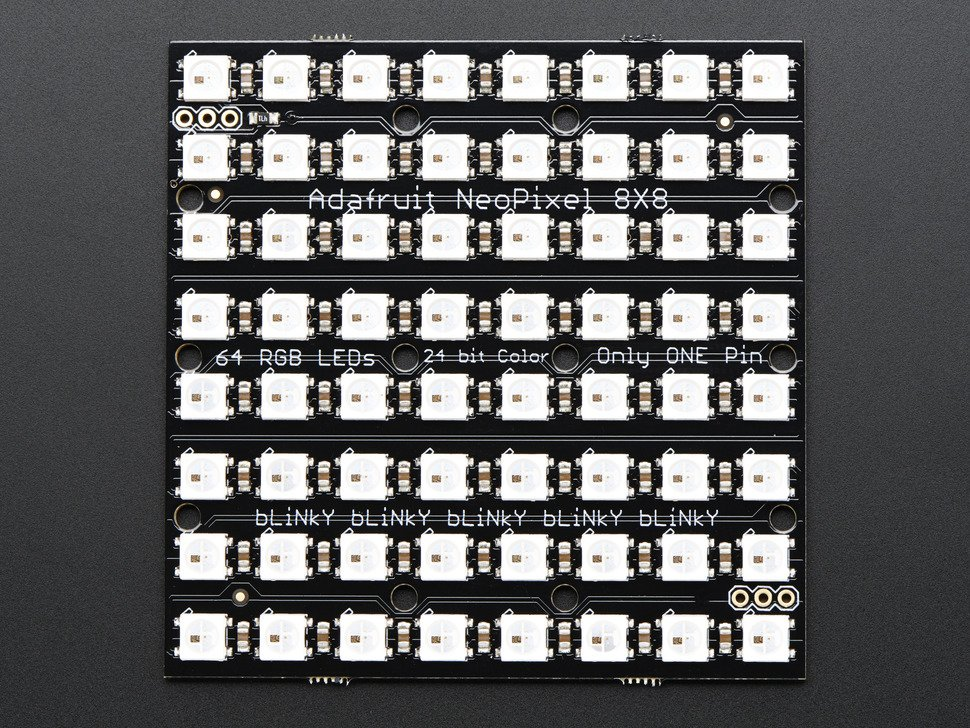
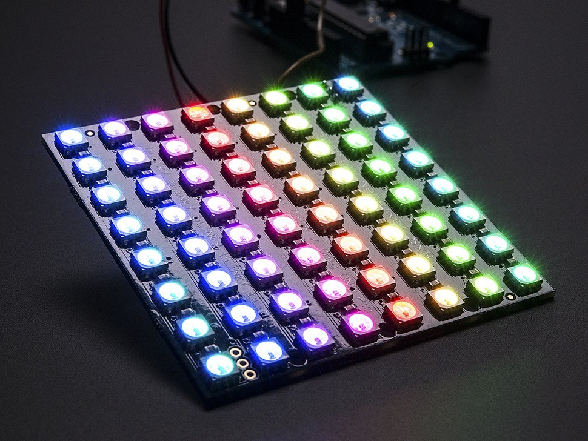
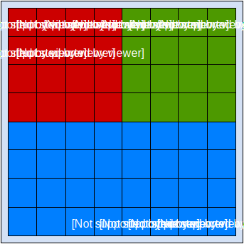
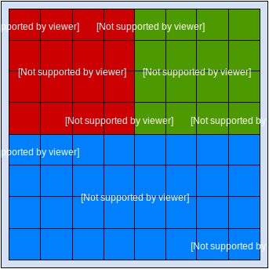

.. automodule:: neotiles

neotiles
========

neotiles is A Python library which allows you to split a `neopixel matrix`_
into independent animated tiles for rendering based on arbitrary input data.

More information
----------------

.. toctree::
   :maxdepth: 1

   pages/installation
   pages/api
   pages/examples

A neopixel matrix contains RGB(W) LED pixels.  Here's what one looks like
(images from `Adafruit`_):

neotiles has been tested on a Raspberry Pi 3 with the above 8x8 neopixel RGB
matrix and Python 3.4 and 2.7.  It has not been tested on Micropython.

What neotiles does
------------------

Normally you control all the pixels in a neopixel matrix via their unique pixel
number, like this matrix which contains pixels 0 through 63:

This works great but can become a little unwieldy if you want to display
multiple things in different sections of your matrix at the same time --
especially if those things are based on input data (perhaps from a few sensors)
which are changing over time (requiring animation).

For example, let's say you wanted to show the readings from three different
sensors in the three blocks shown above (top-left in red, top-right in green,
and bottom in blue); and you wanted the intensity of each block's color to
be affected by the value of the sensor, where a higher sensor value results in
a more brightly-colored block.

neotiles simplifies this by splitting your matrix into independent rectangular
tiles.  Each tile is given some input data, which the tile can use to set set
the color of its own pixels as desired.

With neotiles, the above example can now be treated as 3 separate tiles, each
with its own mini-matrix of pixels always starting at (0, 0):

How to use it
-------------

To use neotiles all you need to do is:

* Create a :class:`~TileManager` object and give it the size of your matrix.
* Create your own subclasses of :class:`~TileHandler` and implement the :meth:`~TileHandler.data` method, which receives incoming data and sets the tile's pixel colors appropriately.
* Register your TileHandler subclass instances with the TileManager object.
* Enable animation with :meth:`TileManager.animate` (if you want any updating tile pixels to be automatically displayed on the matrix).
* Send data to the TileManager object (or individually to each TileHandler object).  The data can be anything in any format, so long as your TileHandlers know how to interpret it and update their pixel colors appropriately.

A quick example
---------------

Below is an example which takes an 8x8 matrix and renders (without input data
or animation) three tiles inside of it: a top-left 4x4 tile (in red), a
top-right 4x4 tile (in green), and an 8x4 bottom tile (in blue): ::

    from neotiles import TileManager, TileHandler, PixelColor

    # Initialize an 8x8 matrix.
    tiles = TileManager(size=(8, 8))

    # Create three tile handlers.  Handlers are told their dimensions
    # later.
    red_handler = TileHandler(default_color=PixelColor(128, 0, 0))
    grn_handler = TileHandler(default_color=PixelColor(0, 128, 0))
    blu_handler = TileHandler(default_color=PixelColor(0, 0, 128))

    # Assign the 3 tile handlers to the matrix.  This is when the
    # tiles will be given their dimensions.
    tiles.register_tile(size=(4, 4), root=(0, 0), handler=red_handler)
    tiles.register_tile(size=(4, 4), root=(4, 0), handler=grn_handler)
    tiles.register_tile(size=(8, 4), root=(0, 4), handler=blu_handler)

    # Display each tile's pixel colors on the neopixel matrix.
    tiles.draw()

This example relies on the default TileHandler class's ``default_color``
parameter to set its color.  Normally you'll write your own subclass of
TileHandler which will set the tile's pixels to more interesting colors (via
your override of the data() method).

You can see more on the :doc:`/pages/examples` page.

.. _neopixel matrix: https://www.adafruit.com/?q=neopixel%20matrix
.. _Adafruit: https://www.adafruit.com
